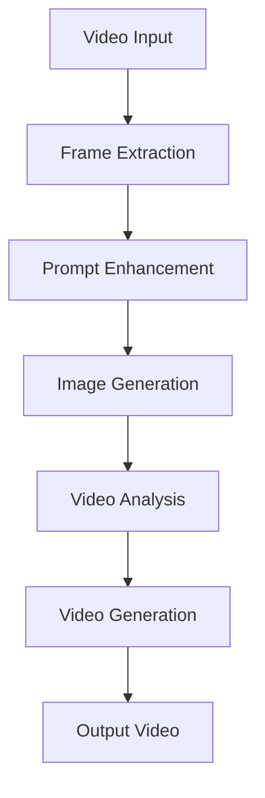

# AI-Powered Video Transformation Pipeline

Transform videos using state-of-the-art AI models with an intuitive web interface. This project leverages Google Gemini and EachLabs APIs to provide intelligent video editing capabilities.

## 🚀 Features

- **Intelligent Frame Extraction**: Smart sampling of key video frames
- **AI-Powered Prompt Enhancement**: Automatic refinement of transformation prompts
- **Advanced Image Generation**: High-quality AI-generated transformations
- **Comprehensive Video Analysis**: Deep understanding of video content
- **Seamless Video Generation**: Smooth output video creation
- **Real-time Progress Tracking**: Monitor each step of the transformation
- **Web Interface**: User-friendly Flask-based application

## 📋 Prerequisites

- Python 3.8 or higher
- FFmpeg installed on your system
- API Keys for:
  - OpenRouter (for Gemini access)
  - Google Gemini API
  - EachLabs API

## 🛠️ Installation

### 1. Clone the Repository

```bash
git clone https://github.com/yourusername/ai-video-transformer.git
cd ai-video-transformer
```

### 2. Set Up Virtual Environment

```bash
python -m venv venv
source venv/bin/activate  # On Windows: venv\Scripts\activate
```

### 3. Install Dependencies

```bash
pip install -r requirements.txt
```

### 4. Configure Environment Variables

Create a `.env` file in the root directory:

```env
OPENROUTER_API_KEY=your_openrouter_key
GEMINI_API_KEY=your_gemini_key
EACHLABS_API_KEY=your_eachlabs_key
```

## 🚀 Quick Start

### Option 1: Using the Web Interface

```bash
python src/api/app.py
```

Then open your browser and navigate to `http://localhost:5001`

### Option 2: Command Line Interface

```bash
python src/core/step5_with_auto_upload.py path/to/video.mp4 "your transformation prompt"
```

## 📁 Project Structure

```
ai-video-transformer/
├── src/
│   ├── core/                  # Core processing pipeline
│   │   ├── step1_frame_extraction.py
│   │   ├── step2_prompt_enhancement.py
│   │   ├── step3_single_output.py
│   │   ├── step4_single_output.py
│   │   └── step5_with_auto_upload.py
│   ├── api/                   # Flask API application
│   │   └── app.py
│   └── utils/                 # Utility modules
│       └── config.py
├── tests/                     # Test suite
│   └── test_pipeline.py
├── templates/                 # HTML templates
│   └── index.html
├── static/                    # Static assets
│   ├── css/
│   └── js/
├── docs/                      # Documentation
├── examples/                  # Example scripts
├── scripts/                   # Utility scripts
├── uploads/                   # Uploaded videos
├── jobs/                      # Job processing data
├── temp/                      # Temporary processing files
├── logs/                      # Application logs
├── requirements.txt           # Python dependencies
├── .env.example              # Environment variables template
├── .gitignore                # Git ignore rules
├── LICENSE                   # License file
└── README.md                 # This file
```

## 🔧 Usage

### Web Interface

1. **Upload Video**: Drag and drop or browse to select your video (max 500MB)
2. **Enter Transformation**: Describe the desired changes
   - Example: "Make everyone wear sunglasses"
   - Example: "Change background to a tropical beach"
   - Example: "Convert to anime style"
3. **Process**: Click "Start Processing"
4. **Download**: Get your transformed video

### API Endpoints

- `GET /` - Main application interface
- `POST /api/process` - Start video processing
- `GET /api/status/<job_id>` - Check processing status
- `GET /api/results/<job_id>` - Get processing results
- `GET /api/file/<job_id>/<type>/<filename>` - Download files
- `DELETE /api/cancel/<job_id>` - Cancel processing
- `GET /api/health` - Health check

### Command Line

```bash
# Basic usage
python src/core/step5_with_auto_upload.py video.mp4 "transformation prompt"

# With custom output directory
python src/core/step5_with_auto_upload.py video.mp4 "prompt" --output-dir ./results

# Extract frames only
python src/core/step1_frame_extraction.py video.mp4 --num-frames 10
```

## 🧪 Testing

Run the test suite:

```bash
python -m pytest tests/
```

Run a specific test:

```bash
python tests/test_pipeline.py
```

## 📊 Processing Pipeline



### Pipeline Steps

1. **Frame Extraction**: Intelligently samples key frames from the input video
2. **Prompt Enhancement**: Uses AI to refine and improve transformation prompts
3. **Image Generation**: Creates transformed images using Gemini Vision
4. **Video Analysis**: Analyzes the video for context and continuity
5. **Video Generation**: Produces the final transformed video

## 🔒 Security

- Never commit `.env` files with API keys
- Use environment variables in production
- Implement rate limiting for public deployments
- Add authentication for sensitive operations
- Regularly rotate API keys

## 🐛 Troubleshooting

### Common Issues

**Server won't start**
- Verify Python version (3.8+)
- Check all dependencies: `pip install -r requirements.txt`
- Ensure port 5001 is available

**Processing fails**
- Verify API keys in `.env`
- Check video file size (<500MB)
- Ensure valid video format (MP4, AVI, MOV, MKV)

**No output video**
- Verify EachLabs API key
- Check internet connection
- Review logs in `logs/` directory

## 🤝 Contributing

1. Fork the repository
2. Create a feature branch (`git checkout -b feature/amazing-feature`)
3. Commit your changes (`git commit -m 'Add amazing feature'`)
4. Push to the branch (`git push origin feature/amazing-feature`)
5. Open a Pull Request

## 📝 License

This project is licensed under the MIT License - see the [LICENSE](LICENSE) file for details.

## 🙏 Acknowledgments

- Google Gemini for AI vision capabilities
- EachLabs for video generation
- OpenRouter for API gateway services
- Flask community for the web framework

## 📧 Contact

For questions or support, please open an issue on GitHub.

---

Built with ❤️ using AI-powered technologies